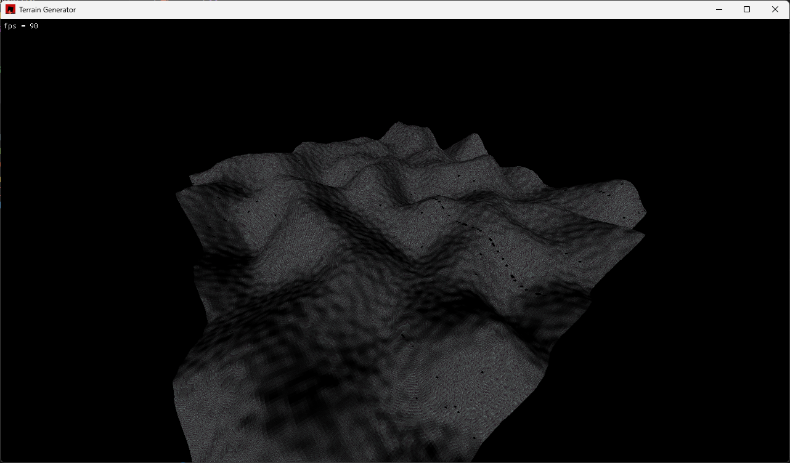
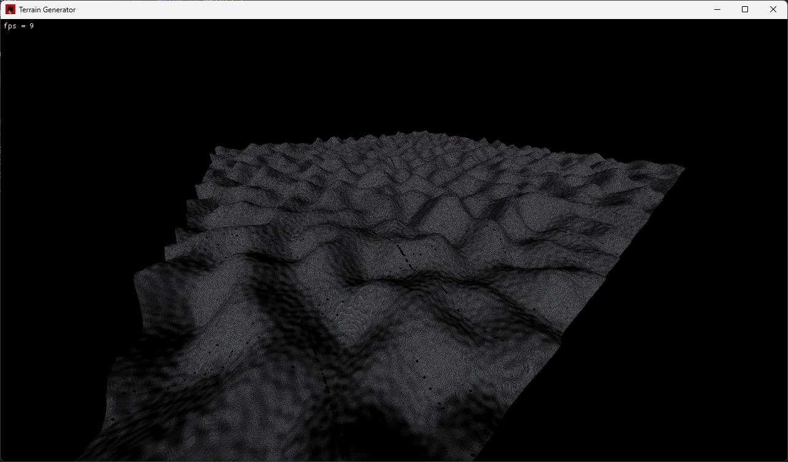

# Terra-Gen

This is a random terrain generator with perlin noise made with [Rust](https://www.rust-lang.org/) using lightweight game library [Macroquad](https://macroquad.rs/).

There is a basic fly camera movement.

It can render 300x300 = 90.000 quad (180.000 triangle) at 90fps, 1000x1000 = 1.000.000 quad (2.000.000) triangle at 10fps only using CPU on my machine (Intel i5-11400H, 16GB DDR4 3200mhz). It can render textures per quad and have little lighting with shaders.

Since I don't know much about shaders, there is a little flicker when quad count is high. I plan to learn shaders... one day.

